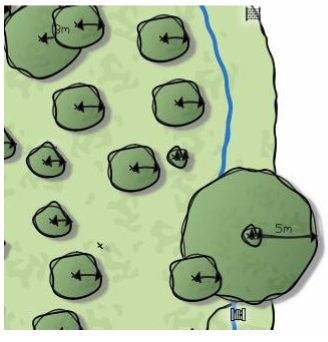

 
# Week one and two
Tasks for the first two weeks:

1. Make a Simple Africa map for journal article
2. Sign up to GitHub, fork the repo and add changes or recommendations to the Handbook cartography guideline
3. Contribute to OSM and HOT tasks 

## Simple Africa Map:
 

Kartoza references relating to this project:
1. QGIS Road to Nerdvana Episode 15: Making a small scale map of Africa:
https://www.youtube.com/watch?v=LJIiZfA7Iio
2. Modules 3, 5 and 6 (Symbology, Labelling and Composer)

## Github Exercise:
1. Fork the Handbook
2. Clone Repo and open on VS code
3. Add the cartography guidelines on the markdown (Follow markdown syntax)
4. To view markdown easily, install Markdown PDF or Markdown All in One and use Ctrl+Shift+V or ‘preview’ icon to see the changes you added in a markdown format
5. Save work and make a pull request

## OSM:
1. Login to account
2. Use search bar to navigate to AOI.
3. Edit> Edit by id
4. If editing polygons, choose area and trace the boundaries and add a tag. Insert ‘Yes’ if you do not know what kind of building the digitised building is, otherwise select from the drop down.
5. Save your work every 10/20 edits with a meaningful name.

Notes from Intern Hang:
1. Keep lab notes for every exercise we get, specifically focussing on steps followed, resources used and corrections made.
2. Make sure you always fork and only do a pull request on the upstream folder, the push request is on your forked repo, not the original. 
3. Cool extensions to have: Github pull request, Markdown All in One, Spell check

# Week 3

Intern Hang Notes:

## Binary number system:
Computer works like light switches, 0-> off and 1-> on. 

Counting systems start from 0, so 16 options could have 15 as a maximum because 0 is a minimum number (like an array when coding)

1010 means 10.
1010 has four numbers, and you multiply the first place value (from left to right) by two so 1010:

fourth number is 23=8, 

third number is  22=4, 

second number is  21=2, 

first number is  20=1, 

Then to get the value 10: (8x1)+(4x0)+(2x1)+(1x0)=10

So when the question is convert 10 to binary:
1.  Think of the suitable decimal position, if we use just three, it would be 4+2+1= 7 and that is less than 10 so increase the decimal position to 4, that would be 8+4+2+1 which is greater than 10, so we are using 4 positions.
2.  Then you think of the multiplication of the positions that would add up to 10: If you said (8x0)+(4x1)+(1x2)+(1x1)=7 so that wont work. Then try (8x1)+(4x0)+(2x1)+(1x0), which adds up to 10. 

Practice questions:
1. Convert 23 to binary:
   
   1.1. 23 so position would be 16+8+4+2+1=31 since if you used 3 positions, it would be less than 23.

   1.2. Then the multiplication sum: 
   
   16x1:1  
   
   8x0: 0
   
   4x1: 1
   
   2x1:  1
   
   <u>1x1: 1</u>

So 23 in binary would be 10111.

Then converting binary to regular numbers:

(16x1)+(8x0)+(4x1)+(2x1)+(1x1)=23

## Hexadecimal number system:
Hexadecimal uses the numbers 0-9. Now if you want to write 10, you're using the first two symbols, which means you have exhausted the list available since we are meant to have 16 symbols. Therefore, after 9, we use A-F. 

8 4 2 1 ----> Hex

0 0 0 0 ----> 0

0 0 0 1 ----> 1

0 0 1 0 ----> 2

0 0 1 1 ----> 3

0 1 0 0 ----> 4

1 0 0 1 ----> 9

1 0 1 0 ----> A (because we reached a point of repetition of numbers)

1 0 1 1 ----> B

1 1 1 1 ----> F (15)

Example:
Convert 11001110100110102 to Hex
 
Step 1: Divide into groups of 4:

1100 1110 1001 1010

Step 2: Represent the groups by hex

1100 is 8x1+4x1= 12 and that's C

1110 is 8x1+4x1+2x1= 14 and that's E

1001 is 8x1 + 1= 9

1010 is 8x1 +2x1= 10 and that's A
 so 11001110100110102 is CE9A16

Therefore, the list for hexadecimal number system wil be: 160 which ranges from 0-F then 161 which ranges 1(0-F)-F(F-F) then 162 and so forth.

## Computer Hardware
Component | Icon       | Description
----------|------------|------------------------
   CPU (Central Processing Unit)|| This is an electronic machinery that carries out instructions from the programs that allow a computer to perform tasks. So this helps make the computations.
   GPU (Graphic Processing Unit) | | This works similarly to a CPU but is designed to accelerate graphics rendering.
   RAM (Random Access Memory)| | Short term memory where data is stored as the processor needs. Difference between this and ROM is that RAM allows reading and writing while ROM only reads.
   SSD (Solid State Drives)| | These are storage drives that are smaller and faster than hard disk drives.
   HDD (Hard Disk Drives| | Non-volatile data storage device. Non-volatile means that the data is maintained even when the storage device is switched off.
   Bus || These are used to send control signals and data between the processor and other components.

   ## Scratch

   
   
   # Week4
   
   ## Python
   
  Properties:
  1. High-level: Python is a very high-level programming language because its syntax so closely resembles the English language. High-level means it is more readible to people. 
  2. General purpose: It is not designed only for a specific purpose, for example: SQL is strictly for handling databases.
  3. Dynamic: Dynamic languages are those whose variables can take on any type at runtime, and usually can even hold multiple values of different types over their lifespan.
  
  Programming concepts:
  1. Variable: Used to store data. Unlike other languages, python can read data type without user specifying data type during variable creation. Eg:
  a= 'abc' -> already registered as string.
  2. If statements: These are used to dictate the output based on different conditions. If condition met -> outcome A, else -> outcome B. If 'And' is used, all the conditions must be met to return true. If 'Or' is used, at least one condition should be met to return true.
  3. Loops: These run until a specified condition is met. For loop differs from while loop in that the intialisation and incrementation happens atthe beginning of the loop.
  4. Functions: This is a block of code that is used to perform a task and can be used multiple times as long as it is called in the code. There are two types: One that requires input during the call and those that do not need inputs (variables) when called.

Duties for the week:
1. Watched tutorials on the Kartoza Intern site.
2. Completed the EMC testing exercise for R1-R7.
3. Signed up for an online python platform (Edabit) that allows user to take on different challenges with different levels of difficulty and get points for solving the python challenges. This will help me get used to the syntax of python and train my mind to think a certain way when I code.

# Week 5

Additional python concepts and tips:
1. When slicing, the outter boundary is an exclusive boundary. E.g: a=[1,2,3] so a[0:2] returns [1,2].
2. {} for sets (removes duplicates), [] for array, () for list
3. When you have variables and methods, class is recommended. 

## Python tasks

Task 1:
Geometry Point Validator

Basic feature:

- Make a Python function that will validate a Point geometry and print whether it is valid and the reason.

- The Lat and Lon in float will be taken from user input.

Additional feature:

- Show the history of all Points entered by the user. It will print the count of Points, followed by each point, validation result and reason.

- End, to end session

- User can choose which feature to use (Validate Point, Check History, or End)

- If the feature user chooses does not exist, then it will print "Command does not exist".
- 
[Task1-code](https://github.com/LunaAsefaw/LabNotes/blob/main/task1.py)

Task 2:
1. Combine your functions into a Class named PointValidator

2. Add error handling at least on the lat and lon input. Think of any error that could be handled.

3. Add feature to export current history to a file. Filename must contain current date and time when the file is exported. Example: "point-2023.02.14-00.15.01", the format is "point-{year}.{double digit month}.{double digit date}-{double digit hour}.{double digit minutes}.{double digit seconds}"

4. Add feature to read exported file. Use must input the filename and/or the full path of the file. The content of the file would be added to the current history. If you used list to store current history, then the file content would be added to that list

[Task2-code](https://github.com/LunaAsefaw/LabNotes/blob/main/task2.py)

## PostgreSQL

 

Primary key (pk): Unique identifier of record in a table.

Foreign key (fk): A key that links two tables. Helpful for normalisation, i.e., reduce redudancy, maintain ACID of database, helps with normalisation. In a one-to-many relationship, the one that can have 'many' records provides the pk as fk. For example, one street can have many people so the table people would have streets id as fk.

Serial: Type of data type that allows automatic incrementation, suitable for primary keys.

Creating a table:

Create table --provide name for table--(list the columns for the table with the data type, whether they will be null or not and indicate the pk)

Example: Create table employees (id serial not null primary key, name varchar(50), surname varchar(200), age int, employer_id int)

If employees is linked to another table, eg employer table. You declare foreign keys by:

foreign-key constraints:

"employer_fk" FOREIGN KEY (id) REFERENCES employer(id)

Format: (name for fk)--Foreign key---(id for the table you want to create a fk)---references---(reference the id that of the table you are linking too)

Creating indexes:
Indexes help improve speed for queries. Implemented through:

create index --give name for index-- on --provide table name--(--input column name)
eg: create index employee_name_idx on employee (name)

Dropping tables:
Format: Drop table --table name--

NB: Tables that are fk in other tables produce an error because they're linked to other tables but if you do brute force delete(cascade), it will be deleted along with records that had a relationship to the deleted table.

Populating the created tables:

Insert into --table name--(list the column names, the same way they are stated in the create table line, just exclude serial id and keep only names) values (insert values in the same order that the columns are listed)

eg: Insert into employees (name, surname, age, employer_id) values ('Luna', 'Asefaw', 23, 2) -- Rememeber the 2 will refer to record id=2 in employer table.

Geospatial SQL:
Creating table with geometry(a polygon):

create table dams (id serial not null primary key, municipality varchar(250), province varchar(100), geom not null);

alter table dams

add constraint dam_geom

check (st_geomtrytype(geom)= 'ST_Polygon'::text) -- this ensures the added feature is a polygon

Foreign keys

Alter table --table name-- add --column name--  --data type-- references -f-fk table--(--id column in fk)

Creating spatial indexes:

Create index --index name-- on --table name-- using gist (--geometry column name--)

Creating a polygon:

Insert into --table name-- (list columns) values (insert values in order. For geomtry column: 'SRID= (Provide espg; POLYGON((x1 y1, x2 y2, x3 y3..x1 y1))

Creating linestring: 

Same as above, except you say LINESTRING instead of polygon and the last coordinate shouldn't be the first coordinate

# Week 6 and 7

## Styling a tree:

 1. Create a point layer witha few digitised points and input varying values for their crown radius.
 2. Symbology> Select single symbol> Change symbol layer to 'geometry generator' and select 'Polygon' for geometry type (this allows the creation of polygon on the points created). 
 3. Input the following expression: 'wave_randomized( 
	buffer($geometry, crown_radius_m),
	1, 3,
	0.01, 0.1,
1)'.  Wave_radomized constructs random curved waves among the boundary of geometry. The size will be based on a buffer that is generated from the radius, thus if radius for point A is 2 and point b is 14, point b will have a bigger buffer around it. We have set the seed to 1, this means the randomised waves generated are not completely random and this saves the state of the random function so even though the are random, they will remain constant so the same numbers will be generated each time. For example the randomness generated for point a and b will be different but each time you run your algorithm, point b will have the same randomised numbers. This prevents the tree styling from changing everytime you move around the canvas. 
4. Duplicate the style so you have a second layer listed and remove the 'Fill' option from the first layer. The order of your styles will be geometry generator> geometry generator> Fill.
5. On the Fill layer, change 'Symbol Layer type' to 'Gradient Fill'. Here you can select a shade of green and draw effects to reflect the colour you'd like. For example, select green, add shade, specify reference points. The reference point 1 tells us where the light of the gradient should originate. The box below shows the top-left represents (x,y) = (0,0) and the bottom-right is (1,1). As such your gradient direction is determined by the (x,y) values in the first and second reference points. Example, reference point 1 (0, 0.45) and reference 2 (1, 0.35), this creates a diagonal line from which light originates.
6. To make the x mark on top of your trees, draw an 'X' in Inkscape and save as SVG.
7. On QGIS, add another layer on your symbology and select 'SVG marker' and add the svg marker created in step 6.

Output:
 
 
 ## Python
 New packages for the week:
Fiona: This reads and writes GIS formats. Using fiona.open() you can read features from GIS formats such as shapefiles and also write to files. 

Code to read shapefiles: 

with fiona.open('shapefile.shp')as shapefile
--Since you will probably want to write to the file, initialise your import with a coordinate system, format driver name and record schema

profile=shapefile.profile
profile['schema']['geometry'] = 'Point'
profile['driver']='GPKG' 

To write to file and export centroid:
with fiona.open('something.gpkg', 'w', ** profile) as output:

 for f in shapefile:
  centroid_shp= shape(f.geometry).centroid
  new_geom= Geometry.from_dict(centroid_shp)
  
  ouput.write(geometry=new_geom, properties=f.properties)
